# クイズ大会 運営マニュアル

このマニュアルは、IT・Web開発の知識がない方でも、このアプリを使ってリアルタイム4択クイズ大会を準備・進行できるようにするための操作マニュアルです。上から順番に読み進めれば、大会の準備から本番進行、終了後の片付けまで行えます。

## 目次

1. [事前準備：ログインする](#1-事前準備ログインする)
2. [大会を作る](#2-大会を作る)
3. [問題を登録する](#3-問題を登録する)
4. [クイズ開始の準備をする（会場モニター・QRコード）](#4-クイズ開始の準備をする会場モニターqrコード)
5. [参加者にQRコードから参加してもらう](#5-参加者にqrコードから参加してもらう)
6. [クイズを進行する](#6-クイズを進行する)
7. [参加者の操作ガイド（かんたん版）](#7-参加者の操作ガイドかんたん版)
8. [ランキングを表示する・大会を終える](#8-ランキングを表示する大会を終える)
9. [こんなときは（よくある質問）](#9-こんなときはよくある質問)

---

## 0. はじめに：全体の流れ

大会当日は、次の順番で操作します。

1. 管理者としてログインする
2. 大会を作る（大会名を決める）
3. 問題を登録する（本番用の問題と、練習問題）
4. 会場の大きな画面（プロジェクターやモニター）に「会場モニター画面」を映す
5. 参加者にQRコードを読み取ってもらい、スマートフォンから参加してもらう
6. 「次の問題へ」→「回答開始」→「回答結果を表示」→「正解発表」を1問ごとに繰り返す
7. 最後に「ランキング表示」で順位を発表する
8. 大会終了後、必要に応じて大会を「リセット」（同じ問題で再戦）「複製」（別大会として再利用）「削除」する

以降の章で、それぞれの操作を画面キャプチャつきで説明します。

---

## 1. 事前準備：ログインする

簡単な説明：大会の準備や進行は、すべて「管理者ログイン」した状態のパソコン（またはタブレット）から行います。運営担当者はまずログインしてください。

### 手順

1. ブラウザで管理者ログイン画面（`/admin/login`）を開きます。
2. 「管理者パスワード」の欄をクリックし、運営から共有されたパスワードを入力します。
3. 「ログイン」ボタンを押します。
4. ログインに成功すると、自動的に「大会管理」画面（大会の一覧画面）に移動します。

【画面キャプチャ】

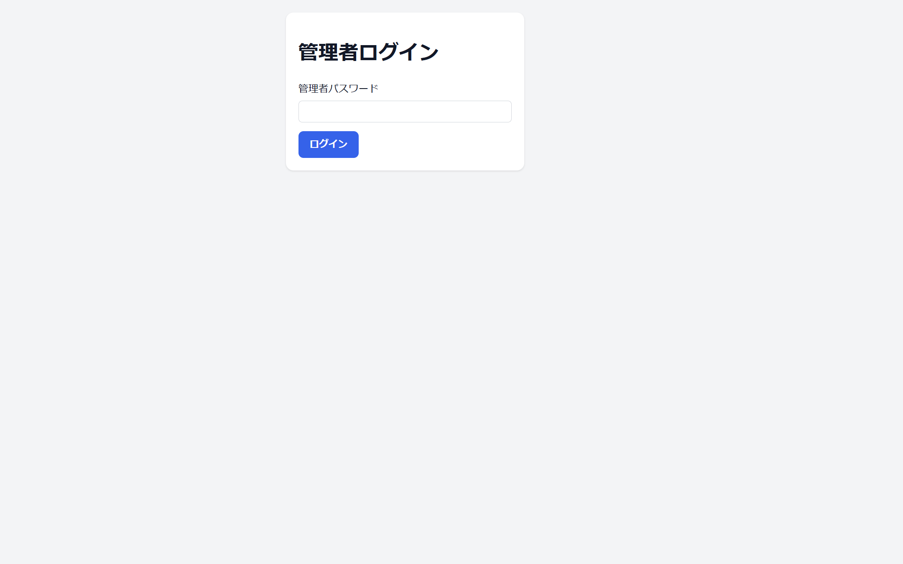

*①「管理者パスワード」欄にパスワードを入力し、②「ログイン」ボタンを押します。*

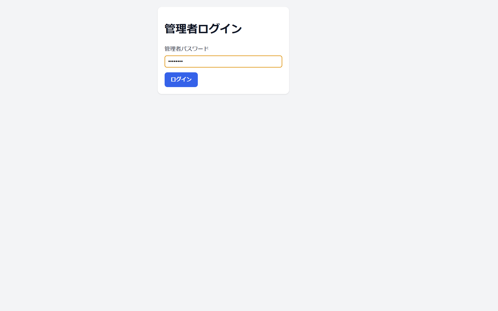

### 補足・注意事項

- パスワードは大会ごとに変わるものではなく、このアプリ全体で共通の管理者パスワードです。事前に運営担当者間で共有しておいてください。
- パスワードを間違えるとエラーメッセージが表示されます。落ち着いてもう一度入力してください。
- ログイン状態はブラウザに保存されます。同じパソコン・同じブラウザであれば、次回以降はログイン操作が不要な場合があります（不安な場合は毎回ログインして問題ありません）。

---

## 2. 大会を作る

簡単な説明：クイズ大会は「大会」という単位で管理します。まず大会を1つ作成するところから始めます。

### 手順

1. 「大会管理」画面を開きます（ログイン後の最初の画面です）。
2. 「新しい大会を作成」の入力欄に、大会の名前を入力します（例：「秋の交流会クイズ大会」）。
3. 「作成」ボタンを押します。
4. 自動的にその大会の管理画面に移動します。以降の問題登録・進行操作はすべてこの画面から行います。

【画面キャプチャ】

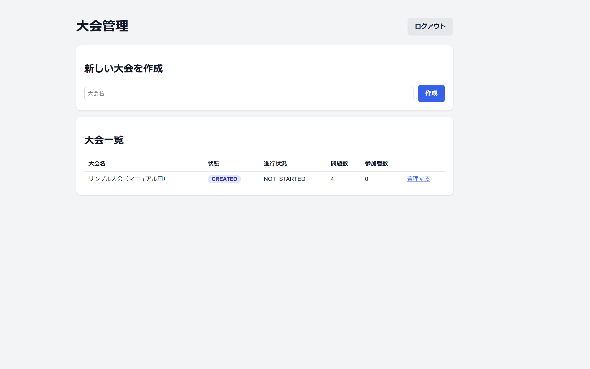

*①「大会名」入力欄に名前を入力し、②「作成」ボタンを押します。*

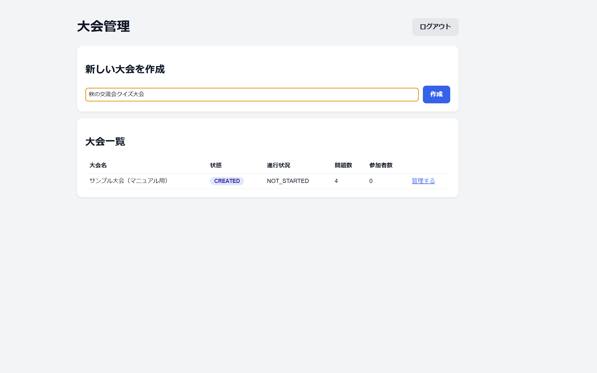

### 補足・注意事項

- 「大会一覧」の表には、これまでに作成したすべての大会が表示されます。「状態」（CREATEDなど）と「進行状況」（NOT_STARTEDなど）で今どの段階かを確認できます。
- 一覧の「管理する」リンクを押すと、その大会の管理画面（問題登録・進行操作の画面）にいつでも戻れます。
- 大会名は後から変更できません（複製機能を使うと、名前を変えた上で同じ問題を使い回すことができます。詳しくは[8章](#8-ランキングを表示する大会を終える)で説明します）。
- 1つの大会を、練習用と本番用など複数回に分けて使い回したい場合は、後述の「大会をリセット」機能が便利です。

---

## 3. 問題を登録する

簡単な説明：大会作成後は「問題管理」タブで問題を登録します。問題は最大10問まで登録でき、さらに「練習問題」を1問だけ追加できます。練習問題は得点やランキングに影響しない、参加者の操作練習用の問題です。

### 手順（問題を1問追加する）

1. 大会の管理画面を開き、上部のタブから「問題管理」を選びます（作成直後は自動的にこのタブが開いています）。
2. 「問題一覧」の右上にある「問題を追加」ボタンを押します。
3. 表示されたフォームに、以下を入力します。
   - **問題番号**：何問目かの番号（自動でその大会の次の番号が入っています）
   - **制限時間（秒）**：回答を受け付ける秒数
   - **問題文**：会場モニターに表示する問題文
   - **問題に添付するメディア**：文章だけの問題なら「なし」のまま、画像や動画を見せたい場合は「画像」または「動画」を選び、「ファイルを選択」でファイルをアップロードします（会場モニターにのみ表示され、参加者のスマートフォンには表示されません）
   - **選択肢A〜D**：それぞれ「表示形式」を「テキスト」「画像」「動画」から選び、テキストなら文章を、画像・動画ならファイルを登録します
   - **これが正解**：4つの選択肢のうち正解のものにチェック（●）を入れます
4. 入力が終わったら「保存」ボタンを押します。
5. 「問題一覧」に登録した問題が追加されます。

【画面キャプチャ】

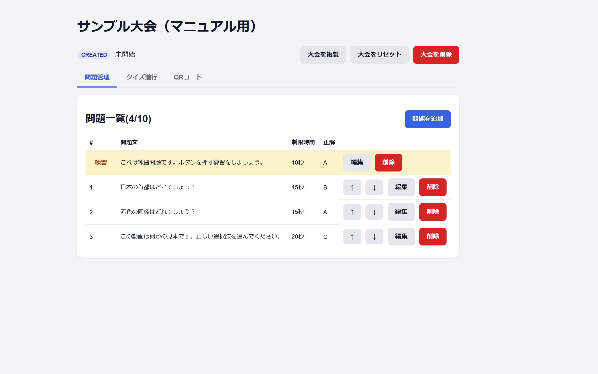

*①上部タブで「問題管理」を選択、②「問題一覧」で登録済みの問題を確認、③「問題を追加」ボタンで新規登録します。一覧の各行には「編集」「削除」ボタン、本番問題には並び順を入れ替える「↑」「↓」ボタンがあります。*

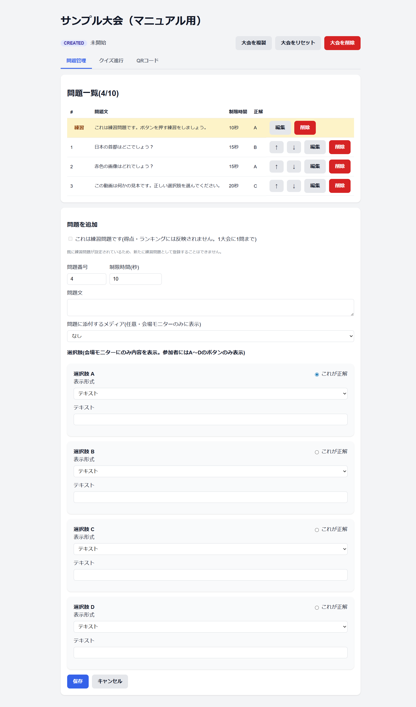

*①問題番号・制限時間、②問題文、③添付メディアの種類、④選択肢A〜D（表示形式・内容・正解ラジオボタン）を入力し、⑤「保存」を押します。*

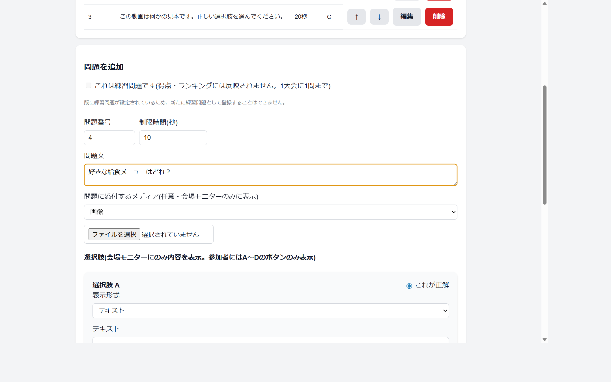

*問題に添付するメディアで「画像」を選ぶと、「ファイルを選択」ボタンが表示されます。ここから会場モニターに映す画像をアップロードします。*

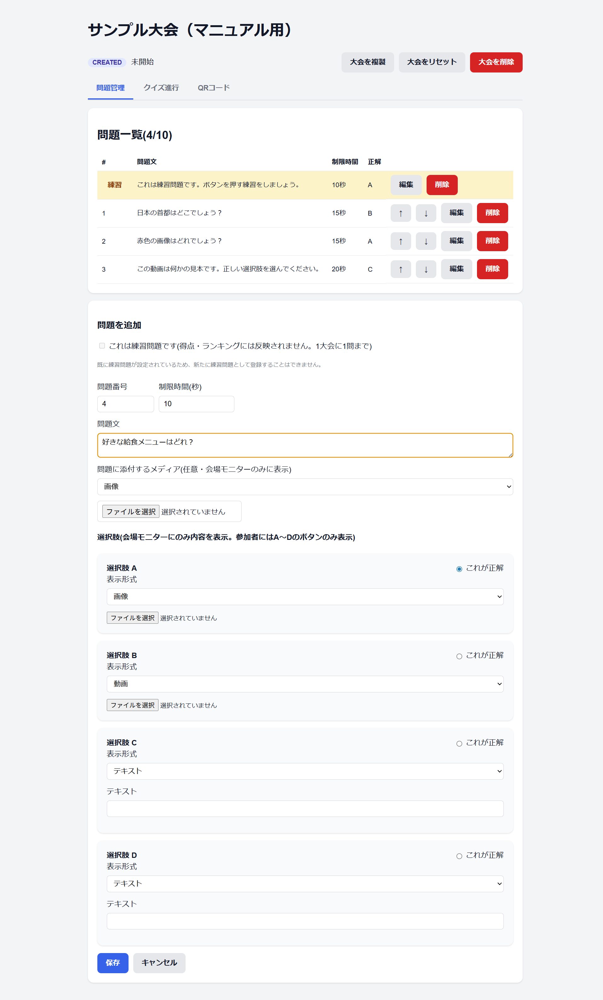

*選択肢ごとに表示形式を「画像」「動画」に変更すると、その選択肢用のファイル選択欄が表示されます。選択肢Aは画像、選択肢Bは動画を設定した例です。*

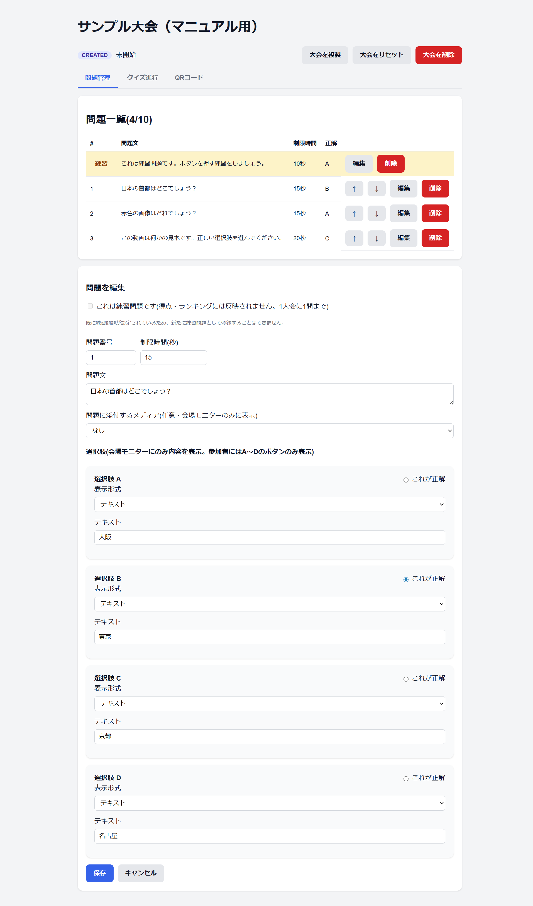

*一覧の「編集」ボタンを押すと、登録済みの内容が入った状態でフォームが開きます。内容を書き換えて「保存」を押せば更新されます。*

### 補足・注意事項

- 「これは練習問題です」にチェックを入れると練習問題として登録できます。練習問題は1大会に1問までで、得点にもランキングにも影響しません。参加者にボタンの押し方を体験してもらうための問題です。すでに練習問題が登録済みの場合、このチェックボックスは押せなくなります。
- 練習問題には問題番号を入力する欄がありません（常に本番の1問目より先に出題されるためです）。
- 問題は最大10問までです。「問題一覧(◯/10)」の表示で現在の登録数を確認できます。
- 本番問題は一覧の「↑」「↓」ボタンで出題順を入れ替えられます。
- 「削除」ボタンを押すと確認メッセージが表示され、「OK」を押すとその問題が削除されます（元に戻せません）。
- 選択肢や問題に添付した画像・動画は、会場モニター画面にのみ表示されます。参加者のスマートフォン画面には「1」「2」「3」「4」の番号ボタンしか表示されないため、画像・動画問題も参加者は番号を選ぶだけで回答できます。

---

## 4. クイズ開始の準備をする（会場モニター・QRコード）

簡単な説明：問題の登録が終わったら、会場の大きな画面に「会場モニター画面」を映し、参加者に配る「参加用QRコード」を準備します。

### 手順

1. 大会の管理画面で「QRコード」タブを開きます。
2. 「参加用QRコード」が表示されます。これを大会会場のスクリーンやチラシに映す・印刷するなどして、参加者が読み取れるようにします。
3. 画面下部の「会場モニター用URL」のリンクを、別のパソコン・タブレットのブラウザで開きます。これをプロジェクターや大型モニターに映すことで「会場モニター画面」になります。
4. 大会が始まる前の会場モニター画面は、大会名だけが表示された待機画面になります。

【画面キャプチャ】

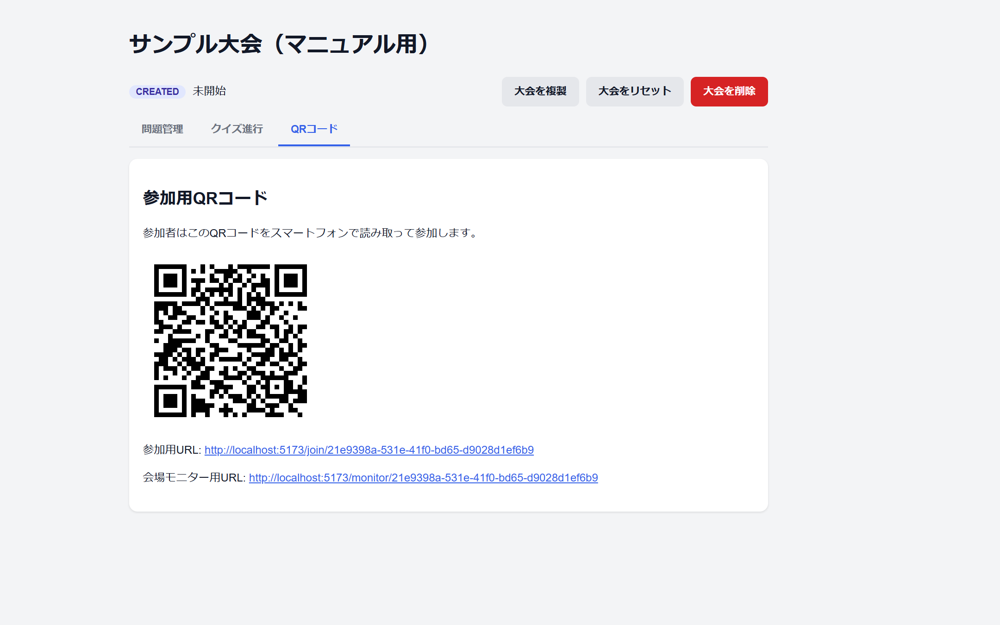

*①「QRコード」タブを開くと、②参加用QRコードと、③参加用URL・会場モニター用URLのリンクが表示されます。QRコードは参加者に、会場モニター用URLは会場の大画面用に使い分けます。*

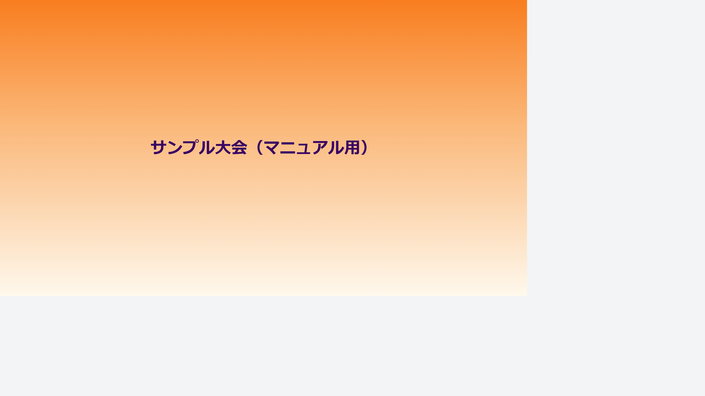

*会場モニター用URLを開いた直後の画面です。まだクイズが始まっていないため、大会名のみが表示されています。プロジェクター等に映しておきます。*

### 補足・注意事項

- QRコードと参加用URLは同じ内容です。QRコードを読み取れない場合は、参加用URLを直接入力・共有しても参加できます。
- 会場モニター用の画面は、参加者のスマートフォンとは別の画面（別の端末・別のブラウザタブ）で開いてください。参加者用の参加画面と会場モニター画面を間違えないよう注意してください。
- 会場モニター画面はプロジェクターなどの横長（16:9）の大画面で見ることを想定した見た目になっています。ノートパソコンの小さい画面でそのまま確認すると、実際の見え方と多少印象が異なる場合があります。

---

## 5. 参加者にQRコードから参加してもらう

簡単な説明：参加者は自分のスマートフォンでQRコードを読み取り、名前を入力するだけで参加できます。運営担当者は、大会が始まる前にこの案内を参加者に行ってください。

### 手順（参加者への案内内容）

1. 参加者にスマートフォンのカメラでQRコードを読み取ってもらいます。
2. 表示された参加画面で「お名前」欄に名前を入力してもらいます。
3. 「参加する」ボタンを押してもらいます。
4. 参加が完了すると、自動的に回答画面に切り替わり「クイズ開始をお待ちください」と表示されます。この状態のまま、クイズが始まるのを待ってもらいます。

【画面キャプチャ】

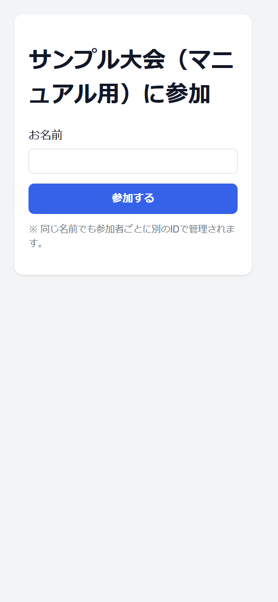

*QRコードを読み取ると表示される画面です。①「お名前」欄に名前を入力し、②「参加する」ボタンを押します。*

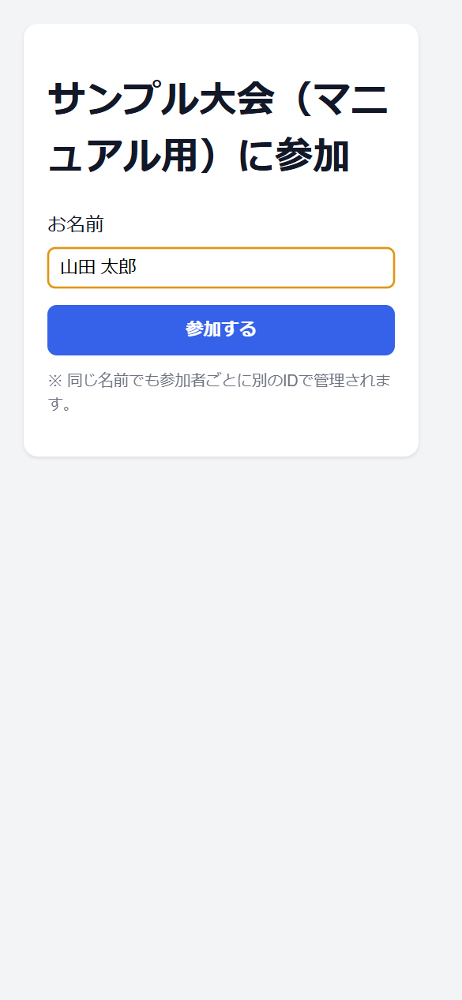

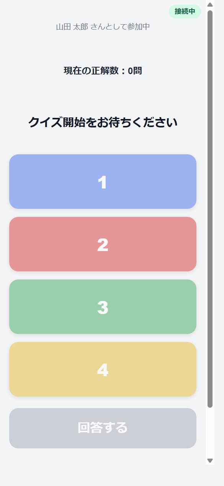

*参加が完了すると、この待機画面に切り替わります。上部に「接続中」と表示されていれば会場と正常に通信できています。「現在の正解数：0問」から始まり、クイズの進行に合わせてこの画面のまま操作していきます。*

### 補足・注意事項

- 参加者の名前は重複しても問題ありません（同じ名前でも参加者ごとに別々に管理されます）。
- 参加はクイズが始まった後でも可能です（途中参加OK）。ただし、参加するタイミングより前に出題された問題には回答できません。
- 一度参加すると、同じスマートフォン・同じブラウザで再度QRコードのURLを開いた場合、名前の入力なしでそのまま回答画面に戻ります。参加者がうっかり画面を閉じてしまっても、もう一度QRコードを読み取れば復帰できます。
- 「接続中」の表示が「再接続中...」に変わった場合は、会場のWi-Fiなど通信状況が不安定になっている可能性があります。時間をおいて改善しない場合は、通信環境を確認してください。

---

## 6. クイズを進行する

簡単な説明：参加者の参加が確認できたら、いよいよクイズ本番です。運営担当者は大会の管理画面の「クイズ進行」タブから、1問ずつボタンを押して進めていきます。会場モニターと参加者のスマートフォン画面は、ボタンを押すたびに自動的に切り替わります。

### クイズ進行タブの見かた

「クイズ進行」タブには、次の情報とボタンが表示されます。

- **WebSocket接続**：「接続中」と表示されていれば、管理画面から会場・参加者へ正常に指示を送れる状態です。
- **現在の問題・進行状況**：「練習問題」または「第◯問」と、今どの段階か（回答待機中・回答受付中・回答受付終了・回答人数表示中・正解発表済み・ランキング表示中）が表示されます。
- **参加者数・接続中人数・回答数**：今何人が参加していて、何人が回答済みかが分かります。
- **進行ボタン**：以下の6つのボタンで会場モニターの表示を切り替えます。押せないボタンは灰色になり、そのタイミングでは押せません。

| ボタン | 押せるタイミング | 効果 |
|---|---|---|
| 次の問題へ | いつでも | 次の問題（練習問題含む）を会場モニターに表示します（まだ回答は受け付けません） |
| 回答開始 | 問題が表示され、回答受付前のとき | その問題の回答受付を開始し、参加者のスマートフォンに選択肢が使えるようになります |
| 次の問題へ+回答開始 | いつでも | 「次の問題へ」と「回答開始」を1回の操作でまとめて行います |
| 回答結果を表示 | 回答受付が終了したとき | 会場モニターに選択肢ごとの回答人数を表示します |
| 正解発表 | 回答人数を表示したあと | 会場モニターに正解と参加者の正誤を表示します |
| ランキング表示 | いつでも | 会場モニターを現在の順位表（TOP10）に切り替えます |

- 画面下部には「現在のランキング(上位5位)」が常に表示されており、まだ発表前でも運営側だけはその時点の順位を確認できます（参加者・会場モニターには見えません）。
- ボタンを押すと確認メッセージ（例：「次の問題へ進みます。よろしいですか?」）が表示されます。「OK」を押すと実行されます。押し間違いを防ぐための確認なので、内容を確認してから進めてください。

【画面キャプチャ】

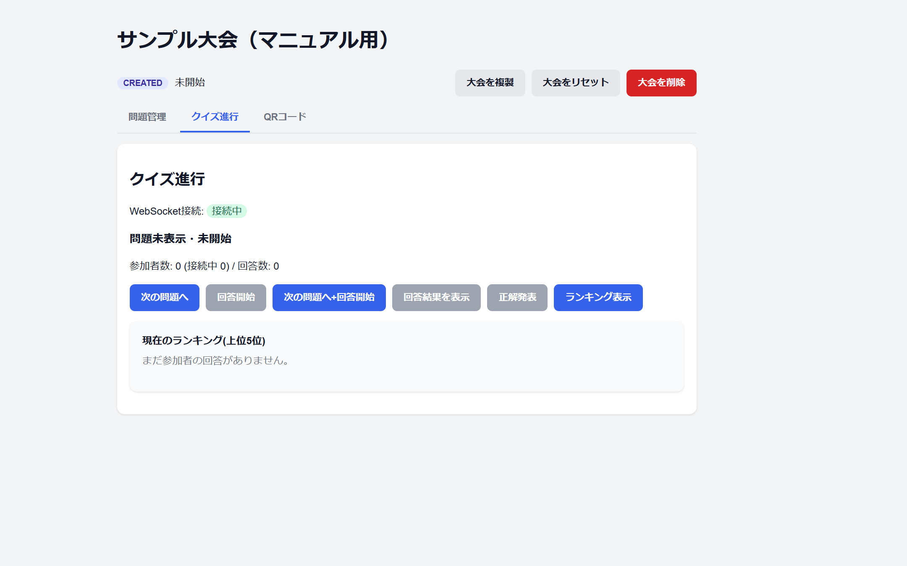

*クイズ開始前の「クイズ進行」タブです。「問題未表示」の状態で、「次の問題へ」または「次の問題へ+回答開始」を押すと最初の問題（練習問題があれば練習問題）に進みます。*

### 進め方の基本パターン

1問ごとに、次の2通りのどちらかの手順で進行します。

- **ゆっくり進める場合**：①「次の問題へ」で問題文を会場に表示して参加者に読んでもらう時間を作る → ②参加者の準備ができたら「回答開始」を押して回答受付を始める。
- **テンポよく進める場合**：①「次の問題へ+回答開始」を1回押すだけで、問題表示と回答受付開始を同時に行う。

回答受付が始まると、制限時間が経過すると自動的に回答受付が終了します（運営が操作しなくても、設定した制限時間が来ると自動で締め切られます）。その後は次の手順です。

3. 「回答結果を表示」で、会場モニターに選択肢ごとの回答人数を表示する。
4. 「正解発表」で、正解と不正解を会場モニターに表示する。
5. 必要なタイミングで「ランキング表示」を押し、順位表を表示する（最後の問題の後だけでなく、途中の問題の後に表示しても構いません）。
6. 「次の問題へ」（または「次の問題へ+回答開始」）で次の問題に進み、2〜5を繰り返す。

### 練習問題を使った流れの例

大会の最初の1問は、多くの場合「練習問題」です。得点やランキングに影響しないため、操作練習として気軽に進められます。以下、練習問題を例に画面の変化を説明します。

【画面キャプチャ】

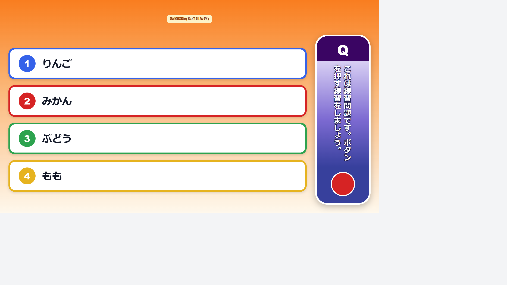

*「次の問題へ」を押した直後の会場モニターです。問題文と選択肢が表示されますが、右側の丸い数字はまだ動いていません（回答受付前のため）。*

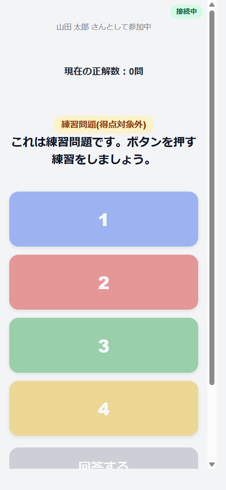

*同じタイミングの参加者画面です。問題文は見えますが「回答する」ボタンはまだ押せません（グレー表示）。回答が始まるまでこのまま待ってもらいます。*

*「回答開始」を押すと、会場モニター右側の丸い数字が残り時間としてカウントダウンを始めます。制限時間が過ぎると自動的に「回答受付終了」の表示に変わります。*

*参加者画面にも同様に残り時間が表示され、この間だけ選択肢をタップして回答できます。制限時間が過ぎると選択肢は押せなくなります。*

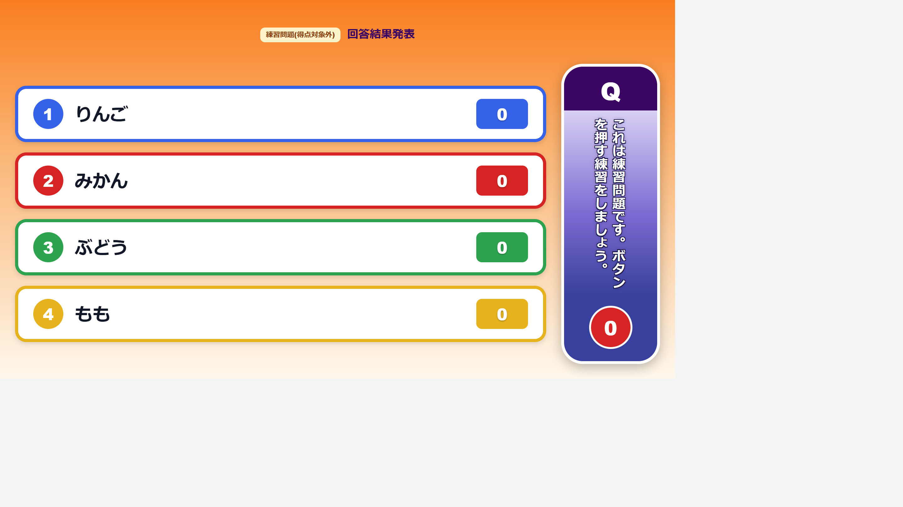

*「回答結果を表示」を押すと、各選択肢の横に回答した人数が表示されます。この時点ではまだどれが正解かは分かりません。*

*参加者画面はこの間、特に大きな変化はなく結果発表を待つ状態です。*

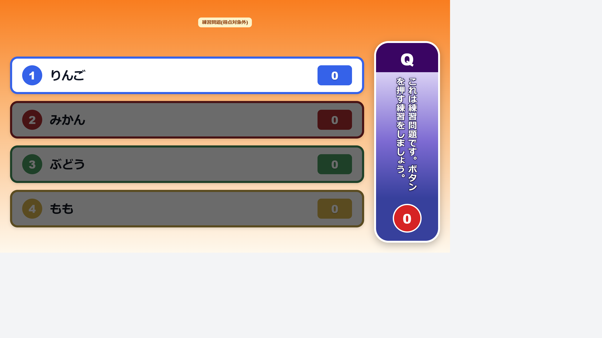

*「正解発表」を押すと、正解の選択肢だけが明るく強調表示され、不正解の選択肢は暗く表示されます。*

*参加者画面にも正解・不正解が表示されます。*

### 参加者の回答操作（選択→送信）

参加者のスマートフォンでは、選択肢をタップすると黒い枠がついて「選んでいる状態」になり、その後「回答する」ボタンを押すことで回答が確定します。

【画面キャプチャ】

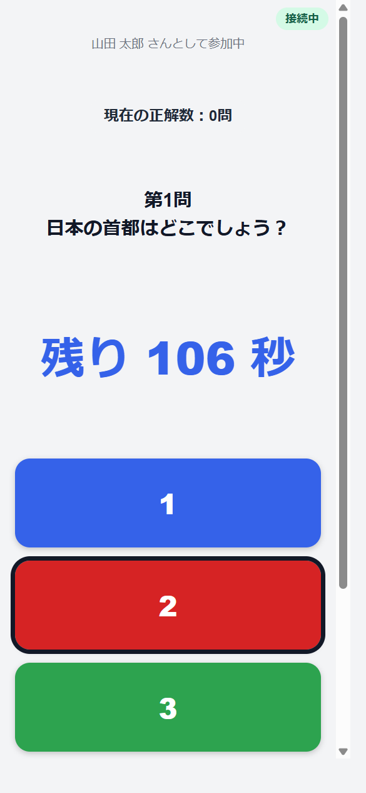

*選択肢をタップすると枠が太くなり、選んでいることが分かります。この時点ではまだ送信されていません。*

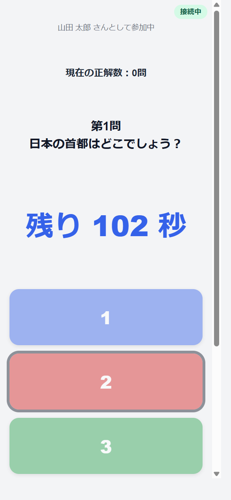

*「回答する」ボタンを押すと回答が確定します。一度送信した回答は変更できないため、参加者にはよく考えてから送信するよう案内してください。*

### 本番問題（第1問〜）の進行

練習問題が終わったら、同じ操作を本番の問題（第1問、第2問…）でも繰り返します。操作方法・画面の流れは練習問題と全く同じです（会場モニター・参加者画面の見た目の違いは、上部に「練習問題(得点対象外)」の表示がなくなり、「第◯問」という表示になる点だけです）。

【画面キャプチャ】

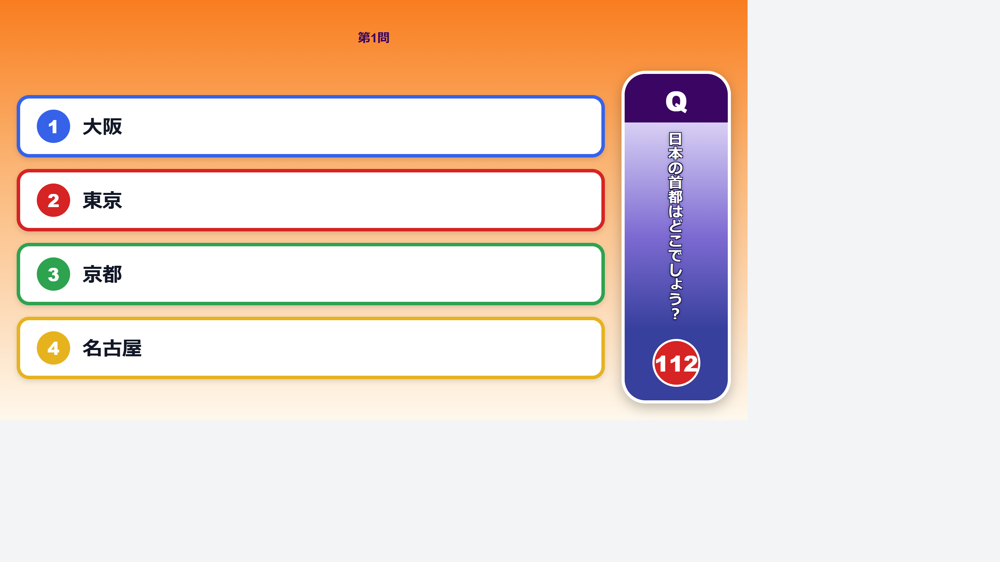

*本番問題では上部に「練習問題」の表示がなく、「第1問」として進行します。操作方法は練習問題と同じです。*

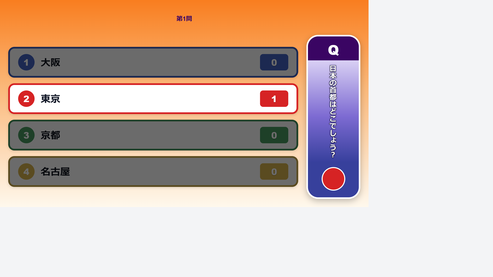

*正解発表の表示形式も練習問題と同じです。*

以降の問題（第2問、第3問…）も、「次の問題へ（+回答開始）」→「回答開始」→「回答結果を表示」→「正解発表」の順に、同じ操作を問題の数だけ繰り返してください。途中で「ランキング表示」を挟んで盛り上げることもできます。

【画面キャプチャ】

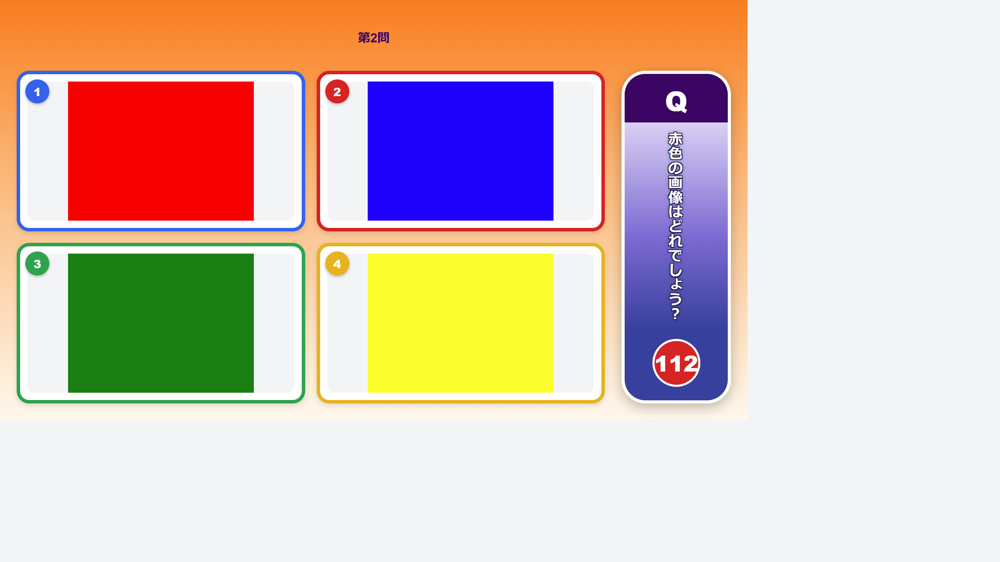

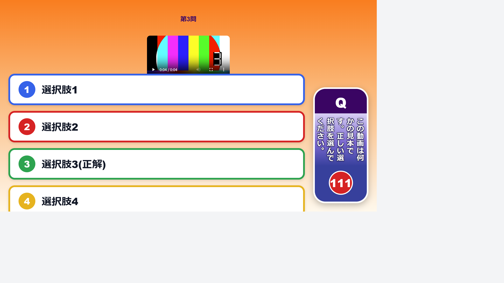

### 補足・注意事項

- 「次の問題へ」と「回答開始」を分けて押すと、参加者に問題文を読んでもらう時間を作れます。急いで進めたい場合は「次の問題へ+回答開始」を使ってください。
- 制限時間が来ると回答受付は自動的に終了します。運営が「回答受付終了」の操作を忘れても、参加者が締切後に回答することはできないので安心してください。
- 一度「正解発表」まで進めた問題は、後戻りできません。誤って早く進めてしまった場合も、そのまま次の問題に進めてください。
- 「現在のランキング(上位5位)」は運営の管理画面にのみ常時表示されており、会場モニターや参加者には「ランキング表示」を押したときだけ表示されます。参加者に見せたくない情報を、押し間違いで表示しないよう注意してください。
- 会場モニターの「正解発表」では、不正解の選択肢は暗く表示され、正解の選択肢だけが目立つようになっています。

---

## 7. 参加者の操作ガイド（かんたん版）

この章は、参加者にそのまま案内できる簡単な説明です。参加者はスマートフォンで問題を確認し、1〜4の番号を選んで回答します。問題文や選択肢の内容は会場モニターに表示されるため、会場の大きな画面を見ながら操作してください。

### 参加前の準備

1. スマートフォンのカメラで、会場に掲示されている参加用QRコードを読み取ります。
2. 参加画面で自分の名前を入力し、「参加する」を押します。
3. 「クイズ開始をお待ちください」と表示されたら、スマートフォンを手元に置いたまま待ちます。
4. 画面上部が「接続中」になっていることを確認します。

名前を登録した後は、同じスマートフォン・同じブラウザで参加用URLを開けば、名前を入力し直さずに回答画面へ戻れます。

### 回答のしかた

回答受付が始まると、画面に「残り◯秒」と表示され、1〜4のボタンを押せるようになります。

1. 会場モニターで問題文と選択肢を確認します。
2. 正しいと思う選択肢に対応する番号（1〜4）をタップします。
3. 選んだ番号に枠が付いたことを確認します。この時点では、まだ回答は送信されていません。
4. 内容を確認して「回答する」ボタンを押します。
5. 「回答を受け付けました」と表示されたら回答完了です。

選択肢の対応は、会場モニターのA〜Dではなく、参加者画面の番号で確認します。通常は、Aが1、Bが2、Cが3、Dが4に対応します。

【画面キャプチャ】

*回答受付前は、問題を確認しながら待ちます。回答受付が始まるまで、番号ボタンと「回答する」ボタンは押せません。*

*答えだと思う番号をタップすると、その番号に枠が付きます。枠が付いただけでは送信されていません。*

*「回答する」を押すと回答が確定します。送信後は、その問題の回答を変更できません。*

### 回答後から正解発表まで

- 回答を送信すると、その問題の回答ボタンは押せなくなります。
- 回答受付が終了した後は、会場モニターで回答人数の集計が表示されます。参加者は会場モニターを見て待ちます。
- 正解発表になると、正解・不正解が表示されます。
- 画面上部の「現在の正解数」は、本番問題で正解した数です。練習問題は得点対象外のため、正解しても正解数やランキングには加算されません。

【画面キャプチャ】

*回答人数の集計中は、会場モニターを見ながら次の表示を待ちます。*

*正解発表中は、会場モニターで正解を確認します。次の問題が始まるまで、画面を閉じずに待ちます。*

### 次の問題への切り替え

運営担当者が次の問題へ進めると、参加者画面の問題文と選択状態が自動的に切り替わります。参加者は、前の問題の画面を自分で更新する必要はありません。

新しい問題が表示されたら、前の問題と同じように番号を選び、「回答する」を押します。問題ごとに回答が管理されるため、前の問題で選んだ番号が次の問題に残ることはありません。

### 参加者向けの注意事項

- 制限時間が終了すると回答できません。時間に余裕を持って番号を選び、「回答する」まで押してください。
- 番号を選んだだけでは回答完了になりません。必ず「回答する」を押してください。
- 「回答を受け付けました」と表示された後は、回答の変更や取り消しはできません。
- 回答中に画面を閉じたり、別のページへ移動したりしないでください。
- 「再接続中...」と表示された場合は、会場のWi-Fiやスマートフォンの通信状態を確認してください。接続が戻るまで、回答操作を控えてください。
- 途中から参加した場合、参加する前に出題された問題には回答できません。参加後に表示された問題から回答してください。

---

## 8. ランキングを表示する・大会を終える

簡単な説明：すべての本番問題が終わったら、「ランキング表示」を押して最終順位を会場モニターに映します。ランキングは、本番問題の正答数が多い人を上位とし、正答数が同じ場合は正解した問題の合計回答時間が短い人を上位にして決まります。練習問題はランキングの計算に含まれません。

### ランキングを表示する

1. 最後の本番問題で「正解発表」まで進めます。
2. 管理画面の「クイズ進行」タブで、回答状況を確認します。
3. 「ランキング表示」ボタンを押します。
4. 確認メッセージが表示されたら、内容を確認して「OK」を押します。
5. 会場モニターにランキングが表示されたことを確認します。

ランキング表示中は、会場モニターに順位・名前・正答数・合計回答時間が表示されます。参加者のスマートフォンにも「ランキング発表中です。会場モニターをご覧ください。」と表示されます。

【画面キャプチャ】

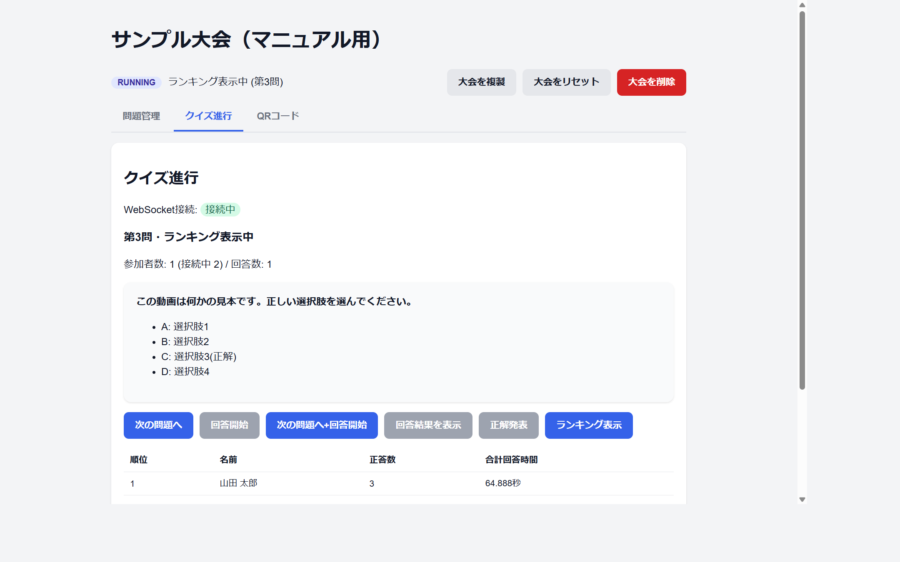

*最後の問題の結果を確認したら、管理画面で「ランキング表示」を押します。管理画面ではランキング表を確認でき、画面下部には進行中も確認できる現在のランキング（上位5位）が表示されます。*

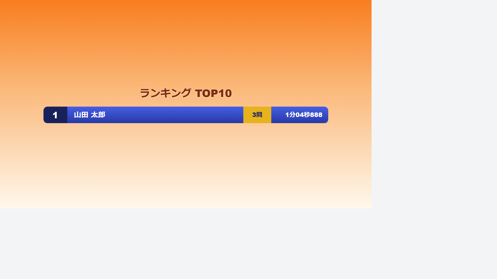

*「ランキング表示」を実行すると、会場モニターに参加者の順位表が表示されます。ここで名前、正答数、合計回答時間を読み上げて表彰してください。*

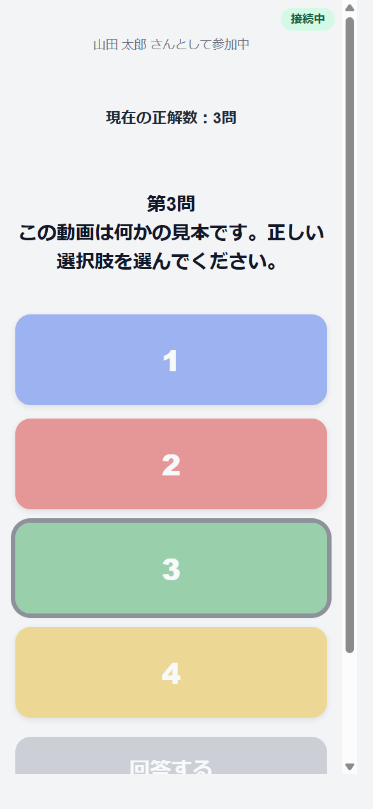

*参加者のスマートフォンにはランキング発表中であることが表示されます。順位表は会場モニターで確認します。*

### 順位の決まり方

- 正答数が多いほど上位になります。
- 正答数が同じ場合は、正解した問題の合計回答時間が短いほど上位になります。
- 合計回答時間は、各問題で回答を送信するまでにかかった時間の合計です。
- 最終ランキングには上位10位までが表示されます。参加者が10人以下の場合は、参加者数に応じて表示されます。
- 管理画面下部の「現在のランキング（上位5位）」は、途中経過を確認するための表示です。最終的な発表には、会場モニターのランキング表示を使ってください。

### 大会終了後にできる操作

ランキング発表が終わったら、同じ大会を今後どうするかに応じて、管理画面上部のボタンを使います。

#### 大会を複製

同じ問題を使って、別の大会を新しく作りたい場合に使います。

1. 大会管理画面上部の「大会を複製」を押します。
2. 新しい大会が作成され、その大会の管理画面へ移動します。
3. 複製された大会で、問題を確認・編集して使用します。

複製では問題設定を再利用できますが、参加者・回答記録・ランキング結果は引き継ぎません。別の日の大会や別グループの大会として使いたい場合に便利です。

#### 大会をリセット

同じ大会名・同じ問題を使って、もう一度最初から開催したい場合に使います。

1. 大会管理画面上部の「大会をリセット」を押します。
2. 確認メッセージの内容を確認します。
3. もう一度使う場合は「OK」を押します。
4. 参加者、回答記録、ランキング結果が削除され、大会が開始前の状態に戻ります。

リセットすると、これまでの参加者・回答・ランキング結果は元に戻せません。記録を残したい場合は、リセットする前に必要な情報を控えてください。問題そのものは残るため、同じ問題で再戦できます。

#### 大会を削除

大会とその大会に紐づく問題・参加者・回答記録を、今後使わない場合に使います。

1. 大会管理画面上部の「大会を削除」を押します。
2. 確認メッセージの内容を確認します。
3. 削除してよければ「OK」を押します。
4. 大会一覧画面へ戻ります。

削除した大会は元に戻せません。少しでも再利用する可能性がある場合は、削除ではなく「大会を複製」または「大会をリセット」を利用してください。

### 大会終了後の注意

- ランキング発表が終わった後も、会場モニターはランキング表示のままにしておけます。
- 同じ大会をすぐに再開催する場合は、参加者・回答記録を消去する「大会をリセット」を実行してから、参加用QRコードを案内し直してください。
- 問題を残したまま別の大会として管理したい場合は「大会を複製」を使ってください。
- 不要になった大会を削除する前に、大会名と対象を確認してください。削除確認で「キャンセル」を選べば削除されません。

---

## 9. こんなときは（よくある質問）

### 管理者ログインができません

- パスワードの大文字・小文字、数字、記号を確認してください。
- 入力欄の前後に不要な空白が入っていないか確認してください。
- パスワードが分からない場合は、システムの管理担当者に確認してください。何度も推測して入力するのではなく、正しいパスワードを共有してもらってください。

### 作成した大会が大会一覧に表示されません

- 大会作成後に表示される大会管理画面から、画面を再度開いて確認してください。
- ブラウザを更新して、大会一覧を読み込み直してください。
- それでも表示されない場合は、別の管理者が作成した大会名や作成時刻を確認し、同じ大会を何度も作成しないようにしてください。

### 「接続中」ではなく「切断」または「再接続中...」と表示されます

管理画面・会場モニター・参加者画面は、リアルタイム通信を使って連動しています。次を順番に確認してください。

1. 端末が会場のWi-Fiまたはインターネットに接続されているか確認します。
2. ブラウザで別のページを開き、通信できるか確認します。
3. 少し待って「接続中」に戻るか確認します。
4. 戻らない場合は、ブラウザを更新します。
5. 管理画面と会場モニターの両方が切断されている場合は、会場のネットワークやサーバーの状態を管理担当者に確認します。

参加者画面が一時的に「再接続中...」になった場合は、接続が戻るまで回答操作を控えてください。回答受付の残り時間はサーバー側で管理されています。

### 参加者がQRコードを読み取れません

- QRコード全体が画面に入っているか確認してください。
- 画面の明るさを上げ、反射や汚れがない状態で読み取ってください。
- カメラをQRコードに近づけすぎず、少し離して読み取ってください。
- 読み取れない場合は、管理画面の「参加用URL」を参加者に共有し、ブラウザへ直接入力してもらってください。

### 参加者が参加したのに回答画面になりません

- 「参加する」ボタンを押したか確認してください。
- 参加後に「クイズ開始をお待ちください」と表示される場合は正常です。運営が問題を開始するまで待ってもらってください。
- 画面が変わらない場合は、参加用URLをもう一度開いてください。同じ端末・同じブラウザなら、登録済みの参加者として回答画面へ戻れる場合があります。
- それでも戻れない場合は、通信状態を確認してから、運営担当者に申し出てもらってください。

### 問題が表示されません

- 管理画面で問題が登録されているか確認してください。
- 「クイズ進行」タブで「次の問題へ」または「次の問題へ+回答開始」を押したか確認してください。
- 会場モニターが「大会名だけの待機画面」のままなら、問題表示の操作がまだ行われていない可能性があります。
- 参加者画面に「クイズ開始をお待ちください」と表示されていても、問題開始前であれば正常です。

### 回答ボタンを押せません

次のいずれかに該当していないか確認してください。

- まだ「回答開始」になっていない（問題表示中・回答受付前）。
- 回答受付の制限時間が終了した。
- すでにその問題へ回答を送信した。
- 参加者画面と会場モニターの通信が切断されている。

問題表示中はボタンが押せなくても正常です。運営が「回答開始」を押し、画面に残り時間が表示されてから回答してください。

### 選択肢を押したのに回答が送信されません

選択肢をタップしただけでは送信されません。選んだ番号に枠が付いたことを確認した後、「回答する」ボタンを押してください。「回答を受け付けました」と表示されれば送信完了です。

### 回答を間違えたので変更したいです

「回答する」を押す前であれば、別の番号を選び直せます。「回答を受け付けました」と表示された後は、回答を変更できません。

### 回答したのに正解数が増えません

- 正解数は、正解発表のタイミングで更新されます。回答直後に増えなくても正常です。
- 練習問題は得点対象外のため、正解しても正解数には加算されません。
- 本番問題で正解しているのに正解数が変わらない場合は、画面を更新せず、まず会場モニターの正解発表を確認してください。それでもおかしい場合は運営担当者に申し出てください。

### 回答人数が参加者数より少ないです

参加者全員が回答するとは限りません。制限時間内に「回答する」まで押していない参加者は、回答人数に含まれません。会場モニターの回答人数は、実際に送信を完了した回答の集計です。

### 回答受付が自動で終了しました

制限時間が経過すると、回答受付は自動的に終了します。これは正常な動作です。管理画面で「回答結果を表示」を押して回答人数を表示し、その後「正解発表」へ進めてください。

### 間違えて「ランキング表示」を押してしまいました

ランキング表示は、会場モニターを順位表に切り替える操作です。問題の回答記録や正解数が消える操作ではありません。続きの問題がある場合は、管理画面で次の問題へ進めてください。最後の問題が終わっている場合は、そのまま表彰・大会終了に進めます。

### 大会をリセットしてしまいました

リセットすると、参加者・回答記録・ランキング結果が削除され、元に戻せません。問題設定は残ります。再開催する場合は、参加者に新しい参加用URLまたはQRコードを案内し、最初から進行してください。

### 大会を削除してしまいました

削除した大会は元に戻せません。削除前に確認メッセージが表示されるため、削除する大会を慎重に確認してください。必要な大会を削除してしまった場合は、システムのバックアップや管理担当者に確認してください。

### 運営が迷ったときの確認順

1. 管理画面の「クイズ進行」タブで、現在の問題と進行状況を確認します。
2. 会場モニターに表示されている内容と、管理画面の進行状況が一致しているか確認します。
3. 参加者画面の「接続中」表示を確認します。
4. 回答受付中であれば、残り時間を確認します。
5. 不明な状態でボタンを連続して押さず、確認メッセージを読んでから1回だけ操作します。

---
